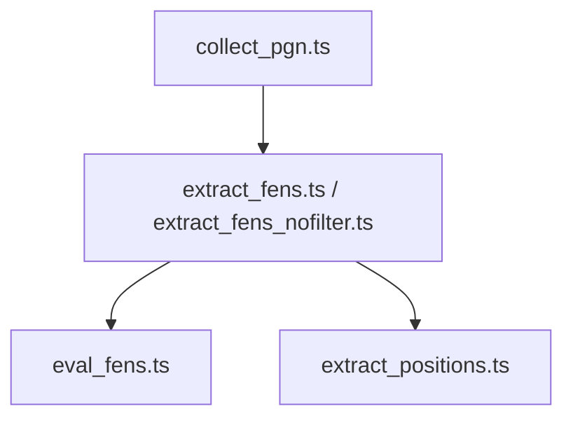

# Chess Data Processing Pipeline

This document describes the data processing pipeline for chess game data, as implemented in the `scripts/data` directory.

---

## Pipeline Overview

The pipeline processes raw chess game data (PGN files) into structured, analyzable formats (Parquet files), and optionally evaluates positions using a chess engine. The main steps are:

1. **Download PGN**: Download a large, compressed PGN file of chess games from Lichess.
2. **Extract FENs**: Parse the PGN file to extract FEN positions and move timings.
3. **Evaluate FENs**: Use Stockfish to evaluate FEN positions and store the results.
4. **(Optional) Extract Rich Positions**: Extract detailed position data with additional metadata and filtering.

---

## Scripts

### 1. `collect_pgn.ts`
- **Purpose:** Downloads a large, compressed PGN file of chess games from Lichess and saves it to the local data directory.
- **Details:** Handles HTTP(S) requests, progress logging, error handling, and file size validation.
- **Output:** `../../data/raw/blitz_2024_03.pgn.zst`

### 2. `extract_fens.ts`
- **Purpose:** Extracts FEN positions and move timing from the downloaded PGN file, writing them to a Parquet file.
- **Details:** Decompresses `.zst` files on the fly using `zstd`. Parses PGN games, filters for blitz games, and extracts FEN, move number, and ply time.
- **Output:** `../../data/fen_moves.parquet`

### 3. `extract_fens_nofilter.ts`
- **Purpose:** Similar to `extract_fens.ts`, but with less filtering and simpler logic.
- **Details:** Reads a PGN file, extracts FENs and move timings, and writes to Parquet. Used for quick extraction or debugging.

### 4. `eval_fens.ts`
- **Purpose:** Evaluates FEN positions using Stockfish and writes the results to a new Parquet file.
- **Details:** Reads FENs from `fen_moves.parquet`. Spawns a Stockfish process, sends FENs for evaluation, and records centipawn scores.
- **Output:** `../../data/fen_eval.parquet`

### 5. `extract_positions.ts`
- **Purpose:** Extracts detailed position data (FEN, move, eval, player ratings, etc.) from compressed PGN files, with filtering options.
- **Details:** Supports filtering by player rating and time control. Writes a richer Parquet schema for downstream analysis.
- **Output:** `../../data/processed/positions.parquet`

---

## Pipeline Flow

---

## Supporting Files
- `parquetjs-lite.d.ts`, `node-zstandard.d.ts`: Type definitions for Parquet and zstd libraries.
- `probe_blitz_header.sh`: Shell script, likely for inspecting PGN headers (not core to the main pipeline).

---

## Notes
- All scripts are designed to run in dev, test, and prod environments without environment-specific hacks.
- Parquet is used for efficient storage and downstream analysis.
- The pipeline is modular; each step can be run independently as needed. 